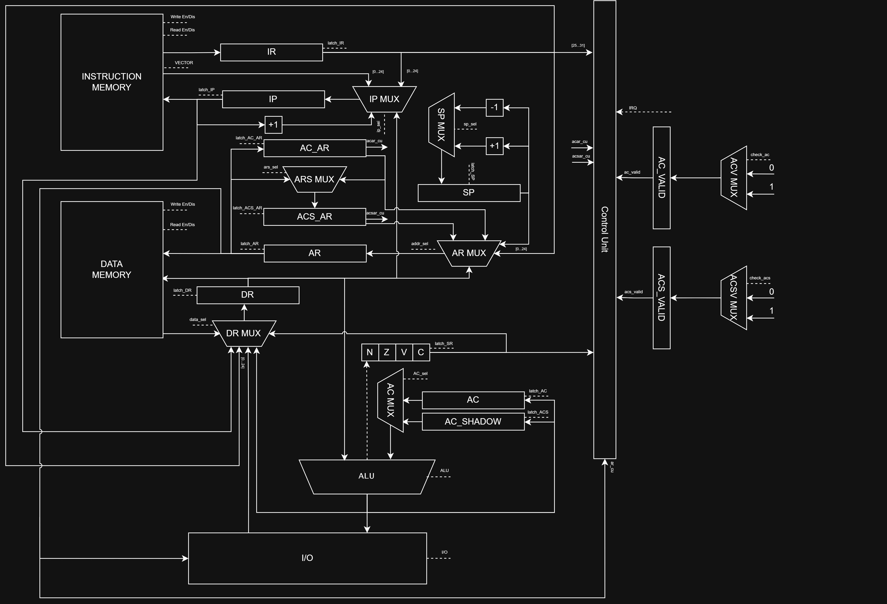
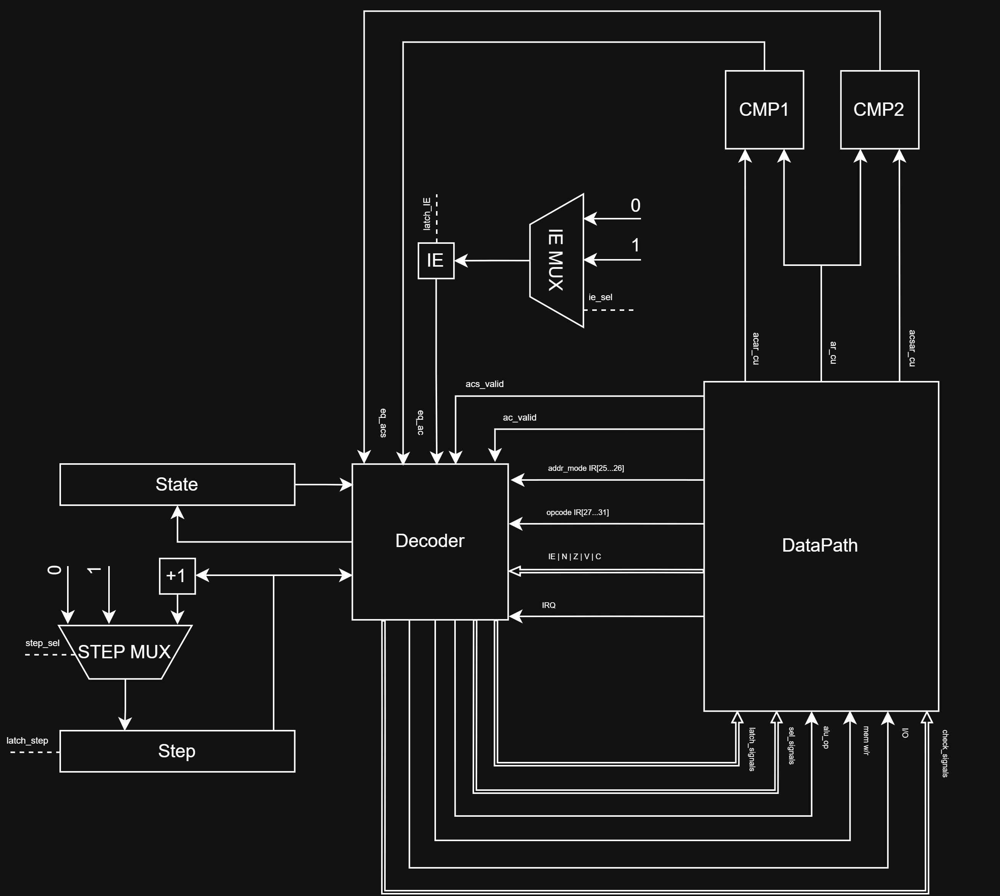

# Лабораторная работа №4. Транслятор и модель процессора

**Автор:** Соболев Егор Викторович, P3209.  
**Дисциплина:** Архитектура компьютера.

## Вариант

```
forth | acc | harv | hw | tick | binary | trap | port | pstr | prob2 | superscalar
```

| Параметр       | Значение                                                                |
|----------------|-------------------------------------------------------------------------|
| `forth`        | Исходный язык - Forth-подобный (стек-ориентированный)                    |
| `acc`          | Аккумуляторная архитектура             |
| `harv`         | Гарвардская: память команд и память данных раздельны                     |
| `hw`           | Hardwired Control Unit                                                   |
| `tick`         | Потактовое (tick-accurate) моделирование                                 |
| `binary`       | Бинарное представление машинного кода (`struct.pack`) + `.txt`-листинг   |
| `trap`         | Ввод-вывод через прерывания по расписанию |
| `port`         | Port-mapped I/O (команды `IN`/`OUT` по номеру порта)                     |
| `pstr`         | Pascal-строки (длина + символы) в памяти данных                          |
| `prob2`        | Project Euler #6 - разница квадрата суммы и суммы квадратов   |
| `superscalar`  | Усложнение: паттерн теневого регистра `AC_SHADOW`                                    |

## Содержание

1. [Язык программирования](#язык-программирования)
2. [Организация памяти](#организация-памяти)
3. [Система команд (ISA)](#система-команд-isa)
4. [Транслятор](#транслятор)
5. [Модель процессора](#модель-процессора)
6. [Суперскалярность (AC_SHADOW)](#суперскалярность-ac_shadow)
7. [Прерывания](#прерывания)
8. [Тестирование](#тестирование)
9. [Запуск](#запуск)

---

## Язык программирования

Реализован Forth-подобный язык с обратной польской записью. Все вычисления идут
через стек данных; вызовы процедур управляются аппаратным стеком возвратов.

### BNF

```ebnf
<program>       ::= { <item> }
<item>          ::= <variable> | <constant> | <definition> | <command>

<variable>      ::= "variable" <name>
<constant>      ::= <number> "constant" <name>

<definition>    ::= ":" <name> { <command> } ";"

<command>       ::= <control_flow> | <word>
<control_flow>  ::= <if> | <loop>
<if>            ::= "IF" { <command> } [ "ELSE" { <command> } ] "THEN"
<loop>          ::= "BEGIN" { <command> } "UNTIL"

<word>          ::= <number> | <string> | <print_string>
                  | <stack_op> | <arith_op> | <compare_op> | <logic_op>
                  | <mem_op> | <io_op> | <xt_op>
                  | <name>                       

<stack_op>      ::= "dup" | "drop" | "swap" | "over"
<arith_op>      ::= "+" | "-" | "*" | "/" | "+c"
<compare_op>    ::= "=" | "<" | ">"
<logic_op>      ::= "and" | "or" | "not"
<mem_op>        ::= "@" | "!"
<io_op>         ::= "key" | "emit" | "type"
<xt_op>         ::= "'" <name> | "execute"

<string>        ::= "s\"" { <char> } "\""        
<print_string>  ::= ".\"" { <char> } "\""       
<number>        ::= [ "-" ] <digit> { <digit> }
<name>          ::= <letter> { <letter> | <digit> | "-" | "_" }
<comment>       ::= "\" { <char> } <newline>
```

Особые формы: `set-irq-handler` (установить обработчик прерывания, перед ним —
ссылка на слово), `halt`, `iret`.

### Семантика ключевых слов

| Слово          | Стек (до → после)         | Описание                                       |
|----------------|---------------------------|------------------------------------------------|
| `dup`          | `( a -- a a )`            | Дублировать вершину                            |
| `drop`         | `( a -- )`                | Снять вершину                                  |
| `swap`         | `( a b -- b a )`          | Поменять местами две верхние                   |
| `over`         | `( a b -- a b a )`        | Скопировать предпоследнее на вершину           |
| `+ - * /`      | `( a b -- r )`            | Арифметика (`/` — целочисленное деление)       |
| `+c`           | `( a b -- r )`            | Сложение с переносом (ADC), для двойной точности |
| `= < >`        | `( a b -- flag )`         | Сравнение (0 / -1)                             |
| `and or`       | `( a b -- r )`            | Побитовая логика                               |
| `not`          | `( a -- r )`              | Побитовое НЕ                                   |
| `@`            | `( addr -- val )`         | Прочитать ячейку памяти                        |
| `!`            | `( val addr -- )`         | Записать в ячейку памяти                       |
| `key`          | `( -- ch )`               | Прочитать символ из порта ввода                |
| `emit`         | `( ch -- )`               | Вывести символ в порт вывода                   |
| `s" …"`        | `( -- addr )`             | Положить адрес pstr-строки                     |
| `type`         | `( addr -- )`             | Вывести pstr-строку                            |
| `." …"`        | `( -- )`                  | Inline-печать строки                           |
| `' word`       | `( -- xt )`               | Положить execution token (адрес процедуры)     |
| `execute`      | `( xt -- )`               | Косвенный вызов процедуры по адресу с вершины  |
| `variable n`   | —                         | Резервирует ячейку, имя кладёт её **адрес**     |
| `N constant n` | —                         | Кладёт значение в секцию данных, имя — **значение** |
| `: f … ;`      | —                         | Определение процедуры `f`                      |
| `IF … ELSE … THEN` | `( flag -- )`         | Условие (0 = false)                            |
| `BEGIN … UNTIL`    | `( flag -- )`         | Цикл с пост-условием: выход по истине          |

### Семантика языка

- **Стратегия вычислений** — строго последовательная, каждый операнд
  вычисляется и кладётся на стек до применения слова.
- **Области видимости** — все имена (переменные, константы, процедуры)
  глобальны и разрешаются на этапе трансляции. Повторное определение имени —
  ошибка трансляции. Локальных переменных нет.
- **Типизация** — динамическая, бестиповая: на стеке лежат 32-битные знаковые
  целые. Интерпретация значения (число / адрес / код символа / флаг / xt)
  определяется словом, которое с ним работает. Runtime-проверок типов нет.
- **Литералы** — целые числа (в т.ч. отрицательные) и строки (`s"`/`."`).

---

## Организация памяти

Архитектура **Гарвардская** — память команд и память данных раздельны.
Машинное слово — **32 бита**. Оба вида памяти адресуются по словам (один
адрес — одно 32-битное слово).

### Память команд

```
Адрес   Содержимое                       Назначение
─────   ──────────────────────────       ───────────────────────────────
  0     JMP <entry/handler>              Вектор прерывания (см. ниже)
  1     JMP <main_start>                 Точка входа (исполнение с адреса 1)
  2..   <код процедур>                   Тела определённых слов (: … ;)
  …     <код главной программы>          Основной поток
  …     HALT                             Останов
```

Адрес 0 — **вектор прерывания**. При старте IP = 1. По умолчанию адрес 0
содержит `JMP` на точку входа; слово `set-irq-handler` перезаписывает адрес 0
на `JMP <обработчик>`, после чего прерывание передаёт управление туда.
Процедуры (`: … ;`) транслируются в общий поток команд и обходятся при прямом
исполнении через `JMP`, вызываются командой `CALL`.

### Память данных

```
Адрес       Содержимое                   Назначение
─────       ──────────────────────       ───────────────────────────────
 0..199     TMP (виртуальный стек)        Временные ячейки вершин стека Forth
 200        PTR_TMP                       Буфер указателя для @ / !
 201        XTR_TMP                       Буфер execution token для execute
 202        ZERO_CELL                     Константа 0 (служебная, для dup)
 203..      переменные, константы,        Данные программы (data_ptr растёт
            pstr-строки, буферы           вверх от DATA_BASE=203)
   …
 4095 <- SP-старт                         Аппаратный стек возвратов (вниз)
```

Аппаратный стек возвратов (`CALL`/`RET`/`IRET`) растёт **вниз** от адреса 4095, а него сохраняются адрес возврата в основную программу, `AC`, `SR (IE, N, Z, V, C)`.  

Виртуальный стек данных Forth реализован статически на этапе трансляции:
вершина стека всегда в `AC`, остальные элементы — во временных ячейках
`TMP_BASE + depth` (см. раздел «Транслятор»), используется для вычислений и манипуляций данными.  

`ZERO_CELL, XTR_TMP, PTR_TMP` - служебные, зарезервированные ячейки  

Основная память данных начинается от `203`, в неё сохраняются переменные, записываются константы и сохраняются результаты работы программы, вохможна ситуация пересечения со стеком возвратов, ответственность возложена на программиста

### Работа с разными видами объектов

**Литералы (числа).** Малые числа (умещающиеся в 25-битное знаковое поле
операнда, `|x| < 2^24`) кодируются **непосредственной адресацией** —
`LOAD #x` кладёт значение прямо из операнда инструкции. Большие числа
(например 3 000 000 000) не помещаются в операнд, поэтому задаются через
`constant`: значение пишется в **секцию данных** бинарного файла (полные
32 бита) и читается прямой адресацией `LOAD addr`, минуя ограничение поля.

**Константы.** `N constant имя` — значение `N` записывается в секцию данных
по выделенному адресу; при использовании имени генерируется `LOAD addr`
(direct), то есть имя кладёт на стек **значение**. Так константа снимает
ограничение 25-битного литерала.

**Переменные.** `variable имя` выделяет одну ячейку (по умолчанию 0). Имя
переменной кладёт на стек её **адрес**; чтение/запись — через `@`/`!`.
Все переменные размещаются в памяти данных.

**Pascal-строки.** `s" …"` размещает строку в секции данных в формате pstr:
`mem[addr]` — длина, `mem[addr+1..]` — коды символов. На стек кладётся адрес.
`type` читает длину и выводит символы. `." …"` печатает строку inline
(последовательность `LOAD #code` / `OUT` для каждого символа, без хранения).

**Инструкции и процедуры.** Тела процедур транслируются в память команд и
вызываются `CALL addr`; адрес зашит в инструкцию. Косвенный вызов (`execute`)
читает адрес процедуры из ячейки данных и вызывает `CALL` по нему.

**Прерывания.** Ввод моделируется расписанием `[(такт, символ)]`. По
наступлении такта символ помещается в порт ввода и выставляется флаг IRQ.
В состоянии FETCH при разрешённых прерываниях (IE=1) управление уходит на
вектор (адрес 0): на стек возвратов сохраняется адрес возврата, IE
сбрасывается, выполняется обработчик до `iret`.

### Секция данных в бинарном файле

Формат `.bin`:
```
[N инструкций : 4 байта][N × 4 байта инструкции]
[M пар данных : 4 байта][M × (адрес : 4 байта, значение : 4 байта)]
```
Секция данных содержит начальные значения (константы, строки) и загружается
в память данных при старте модели. Значения хранятся беззнаково (32 бита)
со знаковым расширением при чтении.

---

## Система команд (ISA)

### Особенности процессора

- **Тип данных** — 32-битное знаковое целое (дополнительный код).
- **Регистры** (DataPath): `AC` (аккумулятор), `AC_SHADOW` (теневой,
  суперскаляр), `IP` (счётчик команд), `IR` (регистр инструкции),
  `AR` (адресный регистр), `DR` (регистр данных), `SP` (указатель стека
  возвратов), `SR` (флаги: N, Z, V, C), `IE` вынесен в ControlUnit, `AC_AR`/`ACS_AR` и биты
  `AC_valid`/`ACS_valid` (суперскаляр).
- **Адресация** — прямая (`DIRECT`), непосредственная (`IMM`), косвенная
  (`INDIRECT`).
- **Ввод-вывод** — port-mapped: `IN port`, `OUT port`. Порт 0 — ввод,
  порт 1 — вывод. Ввод поступает через прерывания.
- **Поток управления** — переходы `JMP/JZ/JN/JNZ/JNN`, вызовы `CALL/RET`,
  прерывания `IRET`. Флаги N, Z, V, C обновляются арифметикой; C —
  только командами `ADD/SUB/INC/DEC/ADC` (доживает до `+c`).

### Формат кодирования инструкции

```
 31      27 26   25 24                     0
+----------+-------+------------------------+
|  opcode  | mode  |        operand         |
|  5 бит   | 2 бит |        25 бит          |
+----------+-------+------------------------+
```

Все инструкции имеют размер 32 бита.
`encode = (opcode << 27) | (mode << 25) | (operand & 0x1FFFFFF)`.
Операнд — 25-битное знаковое (диапазон литерала `LOAD #`: ±2^24).
Режимы: `00` — DIRECT, `01` — IMM, `10` — INDIRECT.

### Набор команд

Полный цикл исполнения любой команды включает **FETCH** (выборка инструкции,
1 такт) и **DECODE** (декодирование + инкремент IP, 1 такт), после чего идёт
**EXECUTE** — переменное число тактов в зависимости от команды и режима
адресации. Таким образом, число тактов в таблицах ниже = `2 (FETCH+DECODE) +
шаги исполнения`.

#### Таблица 1. Мнемоники и назначение

| Мнемоника | Назначение                              | Аргумент |
|-----------|-----------------------------------------|----------|
| `LOAD`    | Загрузка значения в аккумулятор          | да       |
| `STORE`   | Запись аккумулятора в память             | да       |
| `ADD`     | Сложение                                | да       |
| `ADC`     | Сложение с переносом (двойная точность)  | да       |
| `SUB`     | Вычитание                               | да       |
| `MUL`     | Умножение                               | да       |
| `DIV`     | Целочисленное деление                    | да       |
| `AND`     | Побитовое И                             | да       |
| `OR`      | Побитовое ИЛИ                           | да       |
| `NOT`     | Побитовое НЕ                            | нет      |
| `INC`     | Инкремент аккумулятора                   | нет      |
| `DEC`     | Декремент аккумулятора                   | нет      |
| `CMP`     | Сравнение (выставляет флаги)             | да       |
| `JMP`     | Безусловный переход                      | да       |
| `JZ`      | Переход, если ноль (Z=1)                 | да       |
| `JN`      | Переход, если отрицательно (N=1)         | да       |
| `JNZ`     | Переход, если не ноль (Z=0)              | да       |
| `JNN`     | Переход, если не отрицательно (N=0)      | да       |
| `CALL`    | Вызов процедуры                         | да       |
| `RET`     | Возврат из процедуры                     | нет      |
| `IN`      | Чтение из порта ввода                     | да (порт)|
| `OUT`     | Запись в порт вывода                      | да (порт)|
| `IRET`    | Возврат из обработчика прерывания         | нет      |
| `HALT`    | Останов процессора                       | нет      |

#### Таблица 2. Опкоды и такты исполнения

Колонка «такты» учитывает полный цикл (FETCH+DECODE+EXECUTE). Где у команды
несколько режимов адресации, такты указаны для каждого. Колонка «суперскаляр»
показывает изменение относительно обычного режима (`=` — без изменений).

| Опкод | Мнемоника | Действие                          | Такты (обычный)                         | Суперскаляр                                  |
|-------|-----------|-----------------------------------|------------------------------------------|----------------------------------------------|
| 0x01  | LOAD      | AC ← операнд / mem / mem[mem]      | imm: 4, direct: 5, indirect: 7           | direct: 3–7¹, indirect: 11 (+4)              |
| 0x02  | STORE     | mem ← AC                          | direct: 5, indirect: 7                   | direct: 6 (+1)², indirect: 11 (+4)           |
| 0x03  | ADD       | AC ← AC + операнд                 | imm: 4, direct: 5                        | imm: =, direct: 9 (+4)³                      |
| 0x1A  | ADC       | AC ← AC + операнд + C             | imm: 4, direct: 5                        | imm: =, direct: 9 (+4)³                      |
| 0x04  | SUB       | AC ← AC − операнд                 | imm: 4, direct: 5                        | imm: =, direct: 9 (+4)³                      |
| 0x05  | MUL       | AC ← AC × операнд                 | imm: 4, direct: 5                        | imm: =, direct: 9 (+4)³                      |
| 0x06  | DIV       | AC ← AC // операнд                | imm: 4, direct: 5                        | imm: =, direct: 9 (+4)³                      |
| 0x09  | AND       | AC ← AC & операнд                 | imm: 4, direct: 5                        | imm: =, direct: 9 (+4)³                      |
| 0x0A  | OR        | AC ← AC \| операнд                | imm: 4, direct: 5                        | imm: =, direct: 9 (+4)³                      |
| 0x0C  | CMP       | сравнение, выставить флаги         | imm: 4, direct: 5                        | imm: =, direct: 9 (+4)³                      |
| 0x0B  | NOT       | AC ← ~AC                          | 3                                        | =                                            |
| 0x07  | INC       | AC ← AC + 1                       | 3                                        | =                                            |
| 0x08  | DEC       | AC ← AC − 1                       | 3                                        | =                                            |
| 0x0D  | JMP       | IP ← операнд                      | 3                                        | =                                            |
| 0x0E  | JZ        | IP ← операнд, если Z              | 3                                        | =                                            |
| 0x0F  | JN        | IP ← операнд, если N              | 3                                        | =                                            |
| 0x10  | JNZ       | IP ← операнд, если не Z           | 3                                        | =                                            |
| 0x11  | JNN       | IP ← операнд, если не N           | 3                                        | =                                            |
| 0x14  | CALL      | стек ← IP; IP ← операнд           | direct: 7, indirect: 9                   | direct: =, indirect: 13 (+4)                 |
| 0x15  | RET       | IP ← стек                         | 6                                        | =                                            |
| 0x16  | IN        | AC ← порт                         | 4                                        | =                                            |
| 0x17  | OUT       | порт ← AC                         | 3                                        | =                                            |
| 0x18  | IRET      | IP ← стек; IE ← 1                 | 15                                       | =                                            |
| 0x19  | HALT      | останов                           | 3                                        | 7 (+4)⁴                                      |

**Примечания.**  
¹ `LOAD direct` в суперскалярном режиме зависит от состояния теневого регистра:
**3 такта** — dead load elimination (значение уже в AC); **5** — возврат из
тени (swap) или обычная загрузка в свободный слот; **7** — оба слота заняты
(flush AC + загрузка).  
² `STORE direct` в суперскаляре делает deferred store (пометка тега + swap) —
4 шага EXECUTE вместо 3, итого 6 тактов.  
³ Перед арифметикой в direct/indirect суперскаляр вставляет flush обоих слотов
(4 такта), чтобы операнд читался из актуальной памяти, — отсюда `+4`.  
⁴ `HALT` в суперскаляре выполняет parallel flush обоих регистров перед
остановом (`+4`).

Числа `imm`/`direct` различаются на 1 такт, потому что прямая адресация
требует дополнительного такта на защёлкивание адреса в AR перед чтением
памяти; косвенная — ещё на чтение самого адреса из памяти.

---

## Транслятор

### Интерфейс командной строки

Полностью реализован в `src/translator.py`

```bash
python src/translator.py <имя>
```
Берёт `examples/<имя>.forth`, создаёт `build/<имя>.bin` (машинный код +
секция данных) и `build/<имя>.txt` (человекочитаемый дизассемблер).
Пути настраиваются в `src/config.py`.

### Принципы работы

Транслятор однопроходный, поэтому когда адрес с которым работает команда неизвестен по умолчанию ставится 0, в дальнейшем при его определении происходит патч данного адреса на необходимый:

1. **Токенизация** — исходник разбивается на токены по пробелам, с учётом
   строк (`s"`, `."`) и комментариев (`\`).
2. **Виртуальный стек данных.** Вершина стека всегда отображается на `AC`;
   при необходимости освободить `AC` под новое значение прежняя вершина
   сохраняется в ячейку `TMP_BASE + depth` (push), при снятии —
   восстанавливается (pop/restore). Глубина `stack_depth` отслеживается
   статически.
3. **Кодогенерация.** Каждое слово порождает последовательность инструкций
   (например `+` -> `STORE tmp; LOAD a; ADD tmp`). Управляющие конструкции
   (`IF/ELSE/THEN`, `BEGIN/UNTIL`) реализуются переходами с патчами адресов.
4. **Процедуры.** `: f … ;` оборачивается `JMP`-ом для обхода при прямом
   проходе; имя `f` регистрируется с адресом тела; вызов — `CALL`.
5. **Секция данных.** `constant` и `s"` пишут значения в `data_section`;
   она дописывается в `.bin` и загружается в память данных при старте.
6. **Forward-ссылки** (вызов слова / `'` до его определения) разрешаются
   списком патчей после полной трансляции.

---

## Модель процессора
Полностью реализована в `src/machine.py`. Логически разбита на 2 основных блока `DataPath` и `ControlUnit`.

### Интерфейс командной строки

```bash
python src/machine.py <имя> [ввод]
```
Читает `build/<имя>.bin`, выполняет, печатает вывод и журнал. Второй
аргумент — строка ввода: её символы подаются в порт ввода через прерывания
по расписанию (`START_TICK`, `TICK_INTERVAL` в `config.py`).

### Журнал

Журнал содержит для каждого такта: состояние (FETCH/DECODE/EXECUTE),
управляющий сигнал, значения регистров (IP, IR, AC, AR, DR, SP), флаги
(N, Z, V, C, IE), пометку `[IRQ]`. Этого достаточно для пошаговой проверки.

### Особенности моделирования

Модель потактовая: один шаг плана исполнения (`build_plan`) — один такт.
Внутри такта возможно несколько защёлкиваний независимых регистров (через
независимые тракты/MUX), что отражает аппаратную параллельность. Модель
строится вокруг схемы: `latch_*` соответствуют защёлкам регистров,
`*_mux` — мультиплексорам, `alu` — АЛУ. Арифметика АЛУ считается за один
такт.

Полный цикл исполнения инструкции состоит из трёх фаз:

1. **FETCH (1 такт)** — выборка инструкции из памяти команд:
   - проверка наличия прерывания (если IE == 1 и IRQ == 1, управление уходит
     на вектор прерывания вместо обычного исполнения);
   - чтение 32-битного слова из памяти команд по адресу IP;
   - загрузка слова в регистр инструкции IR.

2. **DECODE (1 такт)** — декодирование и подготовка:
   - извлечение опкода (биты 31..27), режима адресации (биты 26..25) и
     операнда (биты 24..0) из IR;
   - инкремент IP (переход к следующей инструкции);
   - построение плана исполнения (последовательности микрошагов) с учётом
     опкода и режима адресации.

3. **EXECUTE (переменное число тактов)** — пошаговое выполнение операции.
   Число тактов зависит от опкода и **режима адресации операнда**:

   - **Непосредственная (IMM, `#x`)** — операнд берётся прямо из поля
     инструкции, обращения к памяти данных нет. Самый короткий путь:
     значение сразу подаётся в АЛУ.
   - **Прямая (DIRECT, `addr`)** — операнд лежит в памяти по адресу из поля
     инструкции. Добавляется такт на защёлкивание адреса в AR и такт на
     чтение ячейки в DR перед использованием. Поэтому прямая адресация на
     1–2 такта длиннее непосредственной.
   - **Косвенная (INDIRECT, `@addr`)** — в поле инструкции лежит адрес
     ячейки, где хранится настоящий адрес операнда. Сначала читается
     адрес (AR ← поле, DR ← mem[AR]), затем по нему читается сам операнд
     (AR ← DR, DR ← mem[AR]). Это ещё +2 такта относительно прямой
     адресации.

### DataPath и Control Unit

Схемы DataPath и ControlUnit приведены в `docs/`.  

Схема `DataPath`
  

Схема `ControlUnit`


DataPath содержит: аккумулятор `AC` и теневой `AC_SHADOW`; регистры
`IP`, `IR`, `AR`, `DR`, `SP`; регистр флагов `SR`; АЛУ (левый вход — `AC`,
правый — выбранный MUX-ом источник); память команд и память данных;
теги `AC_AR`/`ACS_AR` и биты валидности `AC_valid`/`ACS_valid`.
Мультиплексоры (`ip_mux`, `ar_mux`, `dr_mux`, `ac_mux`, `sp_mux`,
`ars_mux`, `acv_mux`, `acsv_mux`) выбирают источники для защёлок.

Control Unit (hardwired): Decoder + регистр состояния (FETCH/DECODE/EXECUTE) + регситр-счетчик микрошагов внутри EXECUTE
формируют управляющие сигналы (латчи, селекторы MUX, код АЛУ, чтение/запись
памяти, I/O). В Decoder входят: опкод и режим из IR, флаги NZVC + IE, IRQ,
а также — для суперскаляра — выходы компараторов (`CMP1`, `CMP2`,
сравнивающих `AR` с тегами `AC_AR`/`ACS_AR`) и биты валидности. Сигнальные
линии от CU к элементам DataPath на схеме обозначены группами
(`latch_signals`, `sel_signals`).

### Архитектура

Процессор разделён на два блока: **DataPath** (тракт данных — регистры,
мультиплексоры, АЛУ, память) и **Control Unit** (устройство управления —
декодер, регистр состояния, компараторы). DataPath выполняет операции,
Control Unit на каждом такте выставляет управляющие сигналы.

#### DataPath

**Память.**

- **Instruction Memory** (память команд). Вход — адрес из `IP`. Выход
  (32-битное слово) идёт в `IR` (по `latch_IR`) и в `IP MUX` (источник
  `VECTOR` — младшие 25 бит слова по адресу 0, адрес обработчика прерывания).
  Управляется сигналами чтения/записи от CU.
- **Data Memory** (память данных). Адрес — из `AR`. Вход данных — из `DR`
  (запись по сигналу `mem w/r`). Выход — в `DR MUX` (источник `MEM`).

**Регистры.** Каждый защёлкивается своим сигналом `latch_*` от CU.

- `IP` (счётчик команд) — вход из `IP MUX`, защёлка `latch_IP`. Выход — на
  адрес Instruction Memory, на `+1` и в `DR MUX` (для сохранения адреса
  возврата на стек).
- `IR` (регистр инструкции) — вход из Instruction Memory, защёлка `latch_IR`.
  Выход разбит на поля: опкода `IR[27:31]` и режима `IR[25:26]` идут в CU,
  операнд `IR[0:24]` — в мультиплексоры (`IP MUX`, `AR MUX`, `DR MUX`).
- `AR` (адресный регистр) — вход из `AR MUX`, защёлка `latch_AR`. Выход — на
  адрес Data Memory и в компараторы CU (`ar_cu`).
- `DR` (регистр данных) — вход из `DR MUX`, защёлка `latch_DR`. Выход — в
  Data Memory (запись), в АЛУ (правый вход `b`), в `IP MUX`/`AR MUX`
  (источник `DR` для косвенной адресации).
- `AC` (аккумулятор) — вход из АЛУ, защёлка `latch_AC`. Выход — в `AC MUX`
  и в `DR MUX` (источник `AC`).
- `AC_SHADOW` (теневой аккумулятор, суперскаляр) — вход из АЛУ, защёлка
  `latch_ACS`. Выход — в `AC MUX`.
- `SP` (указатель стека возвратов) — вход из `SP MUX`, защёлка `latch_SP`.
  Выход — в `AR MUX` (источник `SP`) и на `+1`/`-1`.
- `SR` (регистр флагов `N|Z|V|C`) — вход из АЛУ (N,Z,V,C) и от CU (IE),
  защёлка `latch_SR`. Выход — в CU (как условия переходов) и в `DR MUX`
  (источник `SR` — упаковка флагов для сохранения на стек при прерывании).
- `AC_AR`, `ACS_AR` (теги адресов для суперскаляра) — хранят адрес, которому
  «принадлежит» значение в `AC`/`AC_SHADOW`. Защёлки `latch_AC_AR`,
  `latch_ACS_AR`. Выход — в компараторы CU (`acar_cu`, `acsar_cu`).
- `AC_VALID`, `ACS_VALID` (биты валидности тегов) — вход из `ACV MUX`/`ACSV
  MUX` (константа 0/1), выход — в CU (`ac_valid`, `acs_valid`).

**Мультиплексоры.** Каждый выбирает источник по сигналу `*_sel` от CU.

- **IP MUX** (`ip_sel`) → вход `IP`. Источники: `IP_INC` (IP+1, обычный
  переход к следующей команде), `IR_OPERAND` (адрес перехода/вызова), `DR`
  (адрес возврата из стека при RET/IRET), `VECTOR` (адрес обработчика
  прерывания).
- **AR MUX** (`addr_sel`) → вход `AR`. Источники: `SP` (вершина стека),
  `IR_OPERAND` (прямой адрес), `DR` (косвенный адрес), `AC_AR`/`ACS_AR`
  (адрес для суперскалярного flush), `AR` (прямой провод для swap тегов).
- **DR MUX** (`data_sel`) → вход `DR`. Источники: `MEM` (чтение памяти
  данных), `IP` (сохранение адреса возврата), `IR_OPERAND` (немедленное
  значение), `IO` (чтение порта), `ALU` (результат АЛУ), `AC`
  (сохранение аккумулятора на стек), `SR` (сохранение флагов на стек).
- **AC MUX** (`AC_sel`) → левый вход АЛУ. Источники: `AC` (аккумулятор),
  `AC_SHADOW` (теневой — при swap и возврате значения из тени).
- **SP MUX** (`sp_sel`) → вход `SP`. Источники: `SP_DEC` (SP−1, push на
  стек), `SP_INC` (SP+1, pop со стека).
- **ARS MUX** (`ars_sel`) → вход `ACS_AR`. Источники: `AR`, `AC_AR`
  (перекрёстная пересылка тегов при swap).
- **ACV MUX / ACSV MUX** (`check_ac`/`check_acs`) → входы `AC_VALID`/`ACS_VALID`.
  Источники: константы `0`/`1` (установить/сбросить бит валидности).

**АЛУ.** Левый вход `a` — из `AC MUX` (значение AC или тени). Правый вход
`b` — всегда `DR`. Код операции (`alu_op`) — от CU: `ADD`, `ADC`, `SUB`,
`MUL`, `DIV`, `AND`, `OR`, `NOT`, `INC`, `DEC`, а также `PASS_AC`/`PASS_DR`
(пропустить вход без изменения — для пересылок). Выход АЛУ идёт: вниз — в
`AC`/`AC_SHADOW` (запись результата), в `DR MUX` (источник `ALU`), и в
регистр флагов `SR` (обновление N,Z,V,C; C — только для ADD/ADC/SUB/INC/DEC).
Арифметика считается выполняемой за один такт.

**I/O.** Блок port-mapped ввода-вывода. Вход — из АЛУ/`DR` (для вывода
`OUT`). Выход — в `DR MUX` (источник `IO`, для ввода `IN`). Порт 0 — ввод
(символ от прерывания), порт 1 — вывод.

**Что DataPath передаёт в Control Unit:** опкод `IR[27:31]`, режим
адресации `IR[25:26]`, флаги `IE|N|Z|V|C`, сигнал прерывания `IRQ`, биты
валидности `ac_valid`/`acs_valid`, а также теги и адрес для компараторов
(`acar_cu`, `acsar_cu`, `ar_cu`).

#### Control Unit

Hardwired (с жёсткой логикой). Состоит из декодера, регистра состояния и
двух компараторов.

- **Decoder** — по входам формирует все управляющие сигналы. Входы: опкод
  и режим адресации из `IR`, флаги `IE|N|Z|V|C` (условия переходов), `IRQ`
  (запрос прерывания), биты `ac_valid`/`acs_valid` и результаты компараторов
  `eq_ac`/`eq_acs` (для суперскалярных решений), `State`, `Step`, `IE`. Выходы (группами):
  `latch_signals` (защёлки регистров), `sel_signals` (селекторы MUX),
  `alu_op` (код операции АЛУ), `mem w/r` (чтение/запись памяти), `I/O`,
  `check_signals` (управление битами валидности), `Step`.
- **State** (регистр состояния) — хранит фазу цикла (FETCH / DECODE /
  EXECUTE) декодер использует его для определения разрешения прерывания и для работы со Step.
- **CMP1, CMP2** (компараторы, суперскаляр) — сравнивают адрес в `AR`
  (`ar_cu`) с тегами `AC_AR` (`acar_cu`) и `ACS_AR` (`acsar_cu`).
  Результаты `eq_ac`/`eq_acs` сообщают декодеру, где находится значение по
  запрашиваемому адресу: в аккумуляторе, в тени или в памяти. На основе
  этого выбирается суперскалярное действие (dead load elimination, возврат
  из тени, flush).  
- **Step** (счетчик микрошагов) - устанавливается при EXECUTE, инкрементируется, сбрасывается после исполнения окманды и при прерываниях.
  

Таким образом, Control Unit на каждом такте читает состояние DataPath
(поля IR, флаги, валидность, результаты сравнения) и выставляет сигналы,
управляющие защёлками, мультиплексорами, АЛУ и памятью DataPath. Сигнальные
линии от CU к элементам DataPath на схеме показаны группами
(`latch_signals`, `sel_signals`, …).

---

## Суперскалярность (AC_SHADOW)

Реализована через **паттерн теневого регистра** `AC_SHADOW`, дающий три эффекта.

### Три эффекта

- **deferred store** — `STORE addr` не пишет в память немедленно, а
  откладывает значение: помечает тег `AC_AR = addr`, затем меняет местами
  `AC ↔ AC_SHADOW` (swap). Значение уходит в тень, запись отложена.
- **dead load elimination** — `LOAD addr`: если значение по `addr` уже в
  `AC` (тег совпал, valid), загрузка пропускается; если в тени — значение
  возвращается swap-ом.
- **parallel flush** — при `HALT` оба регистра (`AC`, `AC_SHADOW`)
  сбрасываются в память (суперскалярный момент: два значения готовы и
  пишутся без промежуточной загрузки).

Решение swap/skip/flush принимает Control Unit по результату сравнения
запрашиваемого адреса с тегами (компараторы `CMP1`/`CMP2`) и битам
валидности.

### Обеспечение корректности

Откладывание (swap) меняет содержимое `AC`, что несовместимо с командами,
читающими память напрямую (арифметика читает операнд из памяти) и с
конструкциями, рассчитывающими на сохранение `AC`. Корректность
обеспечивается сбросом отложенных значений (`flush`) в память:

- **перед арифметикой** (`ADD/SUB/MUL/DIV/AND/OR/CMP` в режимах
  direct/indirect) — операнд читается актуальным;
- **перед косвенной адресацией** (`@`/`!`) — память синхронизирована;
- **перед косвенным вызовом** (`execute`) — адрес процедуры актуален;
- **перед входом в прерывание** — отложенное не теряется при затирании `AC`
  обработчиком;
- **в `dup`** — поскольку swap перемещает (не копирует), `dup`
  транслируется как `STORE tmp; ADD ZERO_CELL; LOAD tmp`: `ADD` (direct)
  провоцирует flush значения в память, `LOAD` возвращает копию в `AC`.

### Режим переключается флагом

Флаг `SUPERSCALAR` в `config.py` включает/выключает паттерн на всю машину.
Оба режима дают **идентичный результат**, различаясь журналом. После смены флага программу нужно
перетранслировать.

### Сравнение режимов (такты)

| Программа         | Обычный | Суперскаляр |
|-------------------|--------:|------------:|
| hello             |      94 |          98 |
| cat               |     383 |         402 |
| hello_user_name   |    2419 |        2842 |
| sort              |   14545 |       17725 |
| add64             |    8367 |       10065 |
| prob2             |   45572 |       56234 |
| exectoken         |    3650 |        4367 |
| typetest          |     331 |         416 |
| superscalar_demo  |     347 |         416 |

В стековом коде транслятора деферред-стор почти всегда сразу прерывается
командой, читающей память (арифметика идёт вплотную за `STORE` временной
ячейки виртуального стека), что вынуждает flush. Поэтому суперскалярный
режим даёт **больше** тактов: выигрыш dead-load-elimination не покрывает
стоимость частых сбросов. Физически одновременная запись двух значений невозможна, т.к. это потребовало бы дополнительные регистры адреса и данных и входы в память, поэтому parallel flush реализован как два последовательных store без промежуточной загрузки.

---

## Прерывания

Ввод в процессор организован по модели **trap** — через прерывания по
расписанию.

### Вектор прерывания

Адрес `0` памяти команд зарезервирован под **вектор прерывания**. По
умолчанию транслятор записывает туда `JMP main_start` (переход на точку
входа программы), а исполнение начинается с адреса `1`. Слово
`set-irq-handler` перезаписывает ячейку `0` на `JMP <адрес обработчика>`:
оно берёт адрес процедуры, указанной перед ним (через ссылку на слово), и
патчит вектор. После этого любое прерывание передаёт управление на
обработчик.

В системе **один вектор прерывания** и один источник — порт ввода
(`PORT_STDIN = 0`). Несколько различных векторов/источников не
предусмотрено.

### Возникновение прерывания

Ввод задаётся расписанием — списком пар `(такт, символ)`. На каждом такте
модель проверяет расписание: если наступил такт прихода символа, символ
помещается в порт ввода и выставляется флаг запроса прерывания `IRQ`.

Прерывание **принимается** только при одновременном выполнении трёх
условий:

- установлен запрос `IRQ`;
- прерывания разрешены — флаг `IE = 1`;
- процессор в фазе `FETCH` (то есть между инструкциями, а не посреди
  выполнения текущей).

В ControlUnit происходит проверка текущего State, если FETCH, то выставляется IE.
Проверка в фазе FETCH гарантирует, что прерывание не разорвёт инструкцию
на середине микрошагов — текущая команда всегда завершается целиком.  

### Вход в обработчик (сохранение контекста)

При принятии прерывания процессор:

1. сбрасывает `IE = 0` (запрещает новые прерывания) и снимает запрос `IRQ`;
2. если активен суперскалярный режим — сбрасывает (`flush`) отложенные
   значения из `AC`/`AC_SHADOW` в память, чтобы обработчик видел
   актуальную память и не потерял отложенное;
3. сохраняет на аппаратный стек возвратов **три ячейки** контекста (стек
   растёт вниз, `SP` уменьшается после каждой записи):
   - адрес возврата `IP`;
   - аккумулятор `AC` (проходит через АЛУ операцией `PASS_AC`);
   - регистр флагов `SR`, упакованный в одно слово (`N|Z|V|C`);
4. загружает в `IP` адрес обработчика из вектора (`IP MUX`, источник
   `VECTOR`).

### Тело обработчика и возврат

Обработчик — обычная процедура, завершающаяся словом `iret`. Внутри он
читает символ из порта (`key` → `IN PORT_STDIN`), обрабатывает его
(например сохраняет в переменную или буфер) и возвращается.

Команда **`IRET`** восстанавливает контекст в обратном порядке (стек
LIFO, `SP` увеличивается): сначала флаги `SR` (распаковываются обратно в
`N|Z|V|C`), затем аккумулятор `AC` (через АЛУ `PASS_DR`, без обновления
флагов — чтобы не затереть только что восстановленные), затем адрес
возврата `IP`. В конце `IE` снова устанавливается в `1`, разрешая
последующие прерывания.

### Вложенные прерывания

Вложенные прерывания **не поддерживаются**: при входе в обработчик `IE`
сбрасывается в `0`, поэтому новое прерывание не будет принято, пока
обработчик не завершится командой `iret` (которая возвращает `IE = 1`).

### Интервал расписания

Поскольку обработка одного символа занимает заметное число тактов
(сохранение и восстановление контекста, тело обработчика, печать), интервал
между символами в расписании (`TICK_INTERVAL`) должен превышать время
обработки одного символа. Иначе следующий символ придёт раньше, чем
завершится обработка предыдущего, и будет потерян. 
В конфигурации задан интервал, достаточный для
полной обработки символа.

---

## Тестирование

### Golden-тесты

Интеграционные тесты оформлены как golden-тесты: один YAML-файл на запуск
в `golden/`. Проверяются `pytest`-ом (`tests/test_golden.py`): программа
транслируется, исполняется, вывод и машинный код сравниваются с эталоном.

Каждый эталон содержит: исходный алгоритм (`source`), флаг режима
(`superscalar`), ввод (`input`), вывод (`output`), машинный код с
мнемониками (`machine_code`), журнал моделирования (`log`, обрезанный до
головы и хвоста с пометкой о числе пропущенных тактов — журналы длинных
программ достигают десятков тысяч строк).

Для каждого алгоритма — **два эталона**: обычный режим (`<имя>.yml`) и
суперскалярный (`<имя>_ss.yml`).

### Список кейсов

| Кейс              | Файлы                                                | Описание                                        |
|-------------------|------------------------------------------------------|-------------------------------------------------|
| `hello`           | `golden/hello.yml`, `hello_ss.yml`                   | «Hello, World!» через inline-печать             |
| `cat`             | `golden/cat.yml`, `cat_ss.yml`                       | Эхо ввода (символы через прерывания)            |
| `hello_user_name` | `golden/hello_user_name.yml`, `hello_user_name_ss.yml` | Запрос имени, чтение, приветствие             |
| `sort`            | `golden/sort.yml`, `sort_ss.yml`                     | Сортировка массива (pstr-формат: длина+элементы)|
| `add64`           | `golden/add64.yml`, `add64_ss.yml`                   | Сложение 64-битных чисел (двойная точность, ADC)|
| `prob2`           | `golden/prob2.yml`, `prob2_ss.yml`                   | Project Euler #6 = 25164150 (алгоритм варианта) |
| `exectoken`       | `golden/exectoken.yml`, `exectoken_ss.yml`           | Execution token (`'`/`execute`), косвенный вызов|
| `typetest`        | `golden/typetest.yml`, `typetest_ss.yml`             | Pascal-строка + `type`                          |
| `superscalar_demo`| `golden/superscalar_demo.yml`, `superscalar_demo_ss.yml` | Демонстрация эффектов AC_SHADOW в журнале   |

### CI

В репозитории настроен GitHub Actions (`.github/workflows/ci.yml`): на каждый
push и pull request прогоняются `ruff check`, `ruff format --check`, `mypy`
и `pytest` с golden-тестами. Настройки инструментов — в `pyproject.toml`.

---

## Запуск

### Пример инструментальной цепочки

```bash
# трансляция: examples/sort.forth -> build/sort.bin + build/sort.txt
python src/translator.py sort

# исполнение
python src/machine.py sort
#  Output
# 1 3 5 8 9

# с вводом (через прерывания)
python src/machine.py hello_user_name "Egor"
#  Output
# What is your name? Hello, Egor!
```

### Тесты и проверки

```bash
pytest                  # golden-тесты (оба режима)
ruff check .            # линтер
ruff format --check .   # форматирование
mypy .                  # типы
```
